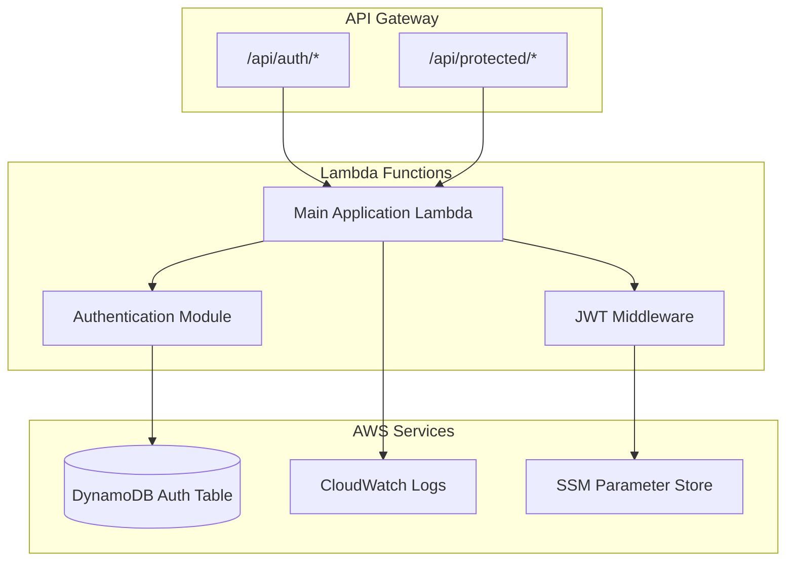
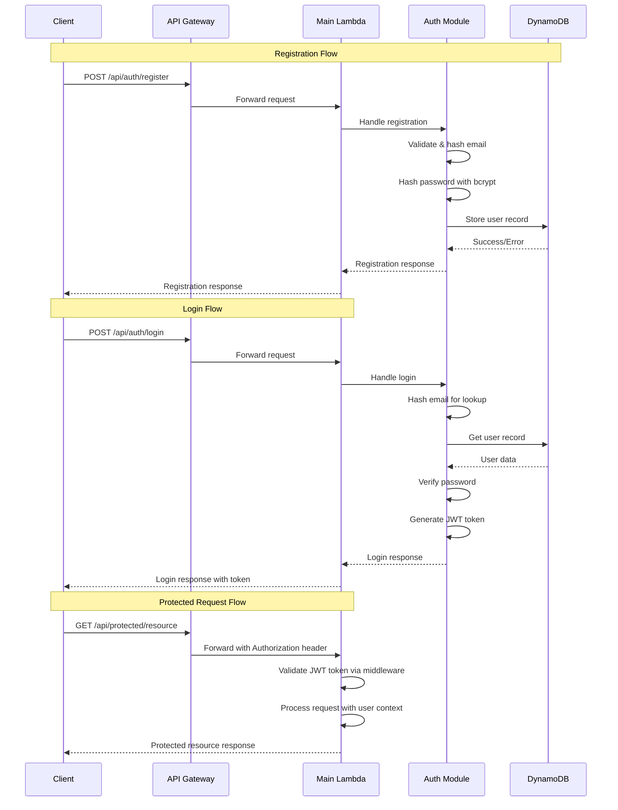

# Design Document

## Overview

The authentication backend provides secure user registration and login functionality for the workout tracker application. This design implements JWT-based session management, secure password handling with bcrypt, and comprehensive error handling. The system integrates with the existing DynamoDB authentication infrastructure and follows Go best practices for Lambda function development.

The implementation uses lightweight Go libraries where beneficial and implements custom solutions for specific authentication requirements, ensuring optimal performance in the Lambda environment.

## Architecture

### High-Level Architecture



### Authentication Flow



## Components and Interfaces

### Lambda Function Structure

**Main Lambda Handler:**
```go
package main

import (
    "context"
    "github.com/aws/aws-lambda-go/events"
    "github.com/aws/aws-lambda-go/lambda"
    "./internal/auth" // Authentication module
    "./internal/core/ports"
)

type Handler struct {
    authService ports.AuthService
    logger      *Logger
}

func (h *Handler) HandleRequest(ctx context.Context, request events.APIGatewayProxyRequest) (events.APIGatewayProxyResponse, error) {
    // Route based on path and method
    // Use auth service for authentication endpoints
    // Handle CORS headers
    // Return structured responses
}
```

**Project Structure (Ports & Adapters):**
```
backend/core/
├── main.go                    # Lambda entry point
├── internal/
│   ├── core/
│   │   ├── domain/           # Business entities
│   │   │   └── user.go
│   │   ├── ports/            # Interfaces (contracts)
│   │   │   ├── auth.go       # AuthService interface
│   │   │   └── repository.go # UserRepository interface
│   │   └── services/         # Business logic implementations
│   │       └── auth/
│   │           └── service.go # AuthService implementation
│   ├── adapters/             # External integrations
│   │   ├── dynamodb/         # DynamoDB adapter
│   │   │   └── user_repository.go
│   │   ├── jwt/              # JWT adapter
│   │   │   └── token_service.go
│   │   └── http/             # HTTP adapter
│   │       └── auth_handler.go
│   └── config/               # Configuration
│       └── config.go
└── go.mod
```

### Core Domain and Ports

**Domain Models (internal/core/domain):**
```go
// User represents the core user entity
type User struct {
    ID           string
    Email        string
    PasswordHash string
    CreatedAt    time.Time
    UpdatedAt    time.Time
}

// AuthToken represents authentication token data
type AuthToken struct {
    Token     string
    UserID    string
    ExpiresAt time.Time
}
```

**Ports (internal/core/ports):**
```go
// AuthService defines the core authentication business logic
type AuthService interface {
    Register(ctx context.Context, email, password string) (*User, error)
    Login(ctx context.Context, email, password string) (*AuthToken, error)
    ValidateToken(ctx context.Context, token string) (*User, error)
}

// UserRepository defines data persistence operations
type UserRepository interface {
    Create(ctx context.Context, user *User) error
    GetByID(ctx context.Context, userID string) (*User, error)
    GetByEmail(ctx context.Context, email string) (*User, error)
}
```

### Adapters Implementation

**DynamoDB Adapter (internal/adapters/dynamodb):**
```go
// UserRepository implements ports.UserRepository
type UserRepository struct {
    client    *dynamodb.Client
    tableName string
}

// DynamoDB-specific user model
type userRecord struct {
    UserID       string `dynamodbav:"user_id"`
    PasswordHash string `dynamodbav:"password_hash"`
    CreatedAt    string `dynamodbav:"created_at"`
    UpdatedAt    string `dynamodbav:"updated_at"`
}

func (r *UserRepository) Create(ctx context.Context, user *domain.User) error {
    // Convert domain.User to userRecord
    // Execute DynamoDB PutItem operation
}

func (r *UserRepository) GetByID(ctx context.Context, userID string) (*domain.User, error) {
    // Execute DynamoDB GetItem operation
    // Convert userRecord to domain.User
}
```

**API Gateway Integration (main.go):**
```go
// Main Lambda handler for API Gateway proxy events
func (h *Handler) HandleRequest(ctx context.Context, request events.APIGatewayProxyRequest) (events.APIGatewayProxyResponse, error) {
    // Route based on path and method
    switch {
    case request.Path == "/api/auth/register" && request.HTTPMethod == "POST":
        return h.handleRegister(ctx, request)
    case request.Path == "/api/auth/login" && request.HTTPMethod == "POST":
        return h.handleLogin(ctx, request)
    default:
        // Apply JWT middleware for protected routes
        return h.handleProtectedRoute(ctx, request)
    }
}

type RegisterRequest struct {
    Email    string `json:"email" validate:"required,email"`
    Password string `json:"password" validate:"required,min=8"`
}

type LoginRequest struct {
    Email    string `json:"email" validate:"required,email"`
    Password string `json:"password" validate:"required"`
}
```

### Service Implementation

**Authentication Service (internal/core/services/auth):**
```go
// Service implements ports.AuthService
type Service struct {
    userRepo  ports.UserRepository
    jwtSecret string
    logger    *Logger
}

func (s *Service) Register(ctx context.Context, email, password string) (*domain.User, error) {
    // Hash email to create user ID
    // Hash password using bcrypt
    // Create user via repository
    // Return user domain object
}

func (s *Service) Login(ctx context.Context, email, password string) (*domain.AuthToken, error) {
    // Hash email to lookup user
    // Verify password using bcrypt
    // Generate JWT token
    // Return auth token
}

func (s *Service) ValidateToken(ctx context.Context, token string) (*domain.User, error) {
    // Validate JWT token
    // Lookup user by ID from token claims
    // Return user domain object
}

// Private helper methods
func (s *Service) hashPassword(password string) (string, error) {
    // bcrypt implementation
}

func (s *Service) verifyPassword(password, hash string) error {
    // bcrypt verification
}

func (s *Service) generateJWT(userID, email string) (string, error) {
    // JWT token generation
}

func (s *Service) validateJWT(token string) (*TokenClaims, error) {
    // JWT token validation
}

type TokenClaims struct {
    UserID string `json:"user_id"`
    jwt.RegisteredClaims
}
```

### Password Security

**Password Service:**
```go
type PasswordService interface {
    HashPassword(password string) (string, error)
    VerifyPassword(password, hash string) error
}

// Implementation using bcrypt
const (
    BcryptCost = 12 // Appropriate for Lambda cold start performance
)
```

## Data Models

### API Request/Response Models

**Registration Endpoint:**
```json
// POST /api/auth/register
{
  "email": "user@example.com",
  "password": "securepassword123"
}

// Response 201 Created
{
  "success": true,
  "message": "User registered successfully",
  "user_id": "a665a45920422f9d417e4867efdc4fb8a04a1f3fff1fa07e998e86f7f7a27ae3"
}

// Response 409 Conflict
{
  "error": {
    "code": "USER_ALREADY_EXISTS",
    "message": "User with this email already exists"
  }
}
```

**Login Endpoint:**
```json
// POST /api/auth/login
{
  "email": "user@example.com",
  "password": "securepassword123"
}

// Response 200 OK
{
  "success": true,
  "token": "eyJhbGciOiJIUzI1NiIsInR5cCI6IkpXVCJ9...",
  "expires_at": "2024-01-16T10:30:00Z",
  "user_id": "a665a45920422f9d417e4867efdc4fb8a04a1f3fff1fa07e998e86f7f7a27ae3"
}

// Response 401 Unauthorized
{
  "error": {
    "code": "INVALID_CREDENTIALS",
    "message": "Invalid email or password"
  }
}
```

### JWT Token Structure

**JWT Claims:**
```json
{
  "user_id": "a665a45920422f9d417e4867efdc4fb8a04a1f3fff1fa07e998e86f7f7a27ae3",
  "iat": 1705312200,
  "exp": 1705398600,
  "iss": "workout-tracker-api"
}
```

**Token Configuration:**
- **Algorithm**: HS256 (HMAC with SHA-256)
- **Expiration**: 24 hours from issue time
- **Secret**: Stored in AWS SSM Parameter Store
- **Issuer**: `workout-tracker-api`

## Error Handling

### Error Response Format

**Standardized Error Structure:**
```go
type ErrorResponse struct {
    Error ErrorDetail `json:"error"`
}

type ErrorDetail struct {
    Code      string    `json:"code"`
    Message   string    `json:"message"`
    Timestamp time.Time `json:"timestamp"`
}
```

### Error Categories

**Authentication Errors:**
- `INVALID_CREDENTIALS`: Login failed (401)
- `USER_ALREADY_EXISTS`: Registration conflict (409)
- `USER_NOT_FOUND`: User lookup failed (401)
- `TOKEN_EXPIRED`: JWT token expired (401)
- `TOKEN_INVALID`: JWT token malformed (401)
- `UNAUTHORIZED`: Missing or invalid authorization (401)

**Validation Errors:**
- `INVALID_EMAIL`: Email format validation failed (400)
- `WEAK_PASSWORD`: Password strength requirements not met (400)
- `MISSING_FIELDS`: Required fields not provided (400)

**System Errors:**
- `INTERNAL_ERROR`: Database or system failure (500)
- `SERVICE_UNAVAILABLE`: Temporary service issues (503)

### Error Handling Strategy

```go
func (h *AuthHandler) handleError(err error) events.APIGatewayProxyResponse {
    var statusCode int
    var errorCode string
    var message string
    
    switch {
    case errors.Is(err, ErrUserAlreadyExists):
        statusCode = 409
        errorCode = "USER_ALREADY_EXISTS"
        message = "User with this email already exists"
    case errors.Is(err, ErrInvalidCredentials):
        statusCode = 401
        errorCode = "INVALID_CREDENTIALS"
        message = "Invalid email or password"
    default:
        statusCode = 500
        errorCode = "INTERNAL_ERROR"
        message = "An internal error occurred"
        h.logger.Error("Unhandled error", "error", err)
    }
    
    return createErrorResponse(statusCode, errorCode, message)
}
```

## Testing Strategy

### Unit Testing

**Test Coverage Areas:**
1. **Password Service**: Hash generation and verification
2. **JWT Service**: Token generation, validation, and expiration
3. **User Repository**: DynamoDB operations with mocks
4. **Auth Service**: Registration and login business logic
5. **Request Validation**: Input validation and sanitization
6. **Error Handling**: All error scenarios and responses

**Testing Framework:**
```go
// Use standard Go testing with testify for assertions
import (
    "testing"
    "github.com/stretchr/testify/assert"
    "github.com/stretchr/testify/mock"
)

func TestAuthService_Register(t *testing.T) {
    // Arrange
    mockRepo := &MockUserRepository{}
    authService := NewAuthService(mockRepo, passwordService, logger)
    
    // Act & Assert
    // Test various scenarios
}
```

### Integration Testing

**Development Environment Testing:**
- Test against AWS DynamoDB in development environment only
- Validate table operations and error handling
- Verify IAM permissions work correctly
- Test Lambda function with API Gateway proxy events
- Validate CORS headers and response formats
- Test authentication middleware with various token scenarios
- Verify error responses match API specifications

### Security Testing

**Authentication Security:**
- Test password hashing with various inputs
- Validate JWT token security (signature verification, expiration)
- Verify no sensitive data in logs or error responses

**Input Validation:**
- Validate email format edge cases
- Test password strength requirements
- Verify request size limits and malformed JSON handling

## Security Considerations

### Password Security

**Bcrypt Configuration:**
- **Cost Factor**: 12 (balanced for Lambda performance)
- **Salt**: Automatically generated by bcrypt
- **Timing**: Consistent verification time to prevent timing attacks

**Password Requirements:**
- Minimum 8 characters
- No maximum length limit (within reasonable bounds)
- No character composition requirements (following modern guidelines)

### JWT Security

**Token Security:**
- **Secret Management**: Store JWT secret in AWS SSM Parameter Store
- **Algorithm**: HS256 (symmetric signing)
- **Expiration**: 24-hour token lifetime
- **Refresh**: Implement token refresh mechanism for long sessions

**Token Validation:**
```go
func (j *JWTService) ValidateToken(tokenString string) (*UserClaims, error) {
    token, err := jwt.ParseWithClaims(tokenString, &UserClaims{}, func(token *jwt.Token) (interface{}, error) {
        if _, ok := token.Method.(*jwt.SigningMethodHMAC); !ok {
            return nil, fmt.Errorf("unexpected signing method: %v", token.Header["alg"])
        }
        return []byte(j.config.SecretKey), nil
    })
    
    if err != nil || !token.Valid {
        return nil, ErrInvalidToken
    }
    
    claims, ok := token.Claims.(*UserClaims)
    if !ok {
        return nil, ErrInvalidToken
    }
    
    return claims, nil
}
```

### Logging Security

**Secure Logging Practices:**
- Never log passwords, tokens, or sensitive data
- Use structured JSON logging with appropriate log levels
- Log authentication events for monitoring
- Include request IDs for tracing without exposing user data

**Log Format:**
```json
{
  "timestamp": "2024-01-15T10:30:00Z",
  "level": "INFO",
  "message": "User login successful",
  "user_id": "a665a45920422f9d417e4867efdc4fb8a04a1f3fff1fa07e998e86f7f7a27ae3",
  "request_id": "12345678-1234-1234-1234-123456789012",
  "ip_address": "192.168.1.1"
}
```

## Dependencies and Libraries

### Go Dependencies

**Core Dependencies:**
```go
// AWS SDK
github.com/aws/aws-sdk-go-v2/service/dynamodb
github.com/aws/aws-sdk-go-v2/service/ssm
github.com/aws/aws-lambda-go/lambda
github.com/aws/aws-lambda-go/events

// Authentication & Security
github.com/golang-jwt/jwt/v5
golang.org/x/crypto/bcrypt

// Validation
github.com/go-playground/validator/v10

// Logging
github.com/rs/zerolog

// Testing
github.com/stretchr/testify
```

**Rationale for Library Choices:**
- **JWT**: `golang-jwt/jwt/v5` - Mature, well-maintained JWT library
- **Password Hashing**: `golang.org/x/crypto/bcrypt` - Standard Go crypto library
- **Validation**: `go-playground/validator/v10` - Comprehensive validation with struct tags
- **Logging**: `zerolog` - High-performance structured logging
- **AWS SDK v2**: Latest AWS SDK with better performance and type safety

### Environment Configuration

**Environment Variables:**
```bash
# Lambda environment variables
ENVIRONMENT=development
JWT_SECRET_PARAMETER=/workout-tracker/jwt-secret
DYNAMODB_TABLE_NAME=workout-tracker-auth-development
LOG_LEVEL=INFO
```

**SSM Parameters:**
- `/workout-tracker/jwt-secret`: JWT signing secret (SecureString)
- Environment-specific parameter paths for different deployments

## Deployment Configuration

### Lambda Function Configuration

**Function Settings:**
- **Runtime**: `provided.al2` (custom Go runtime)
- **Architecture**: `arm64`
- **Memory**: 256 MB (increased for bcrypt operations)
- **Timeout**: 30 seconds
- **Environment Variables**: As specified above

### API Gateway Integration

**Authentication Endpoints:**
```
POST /api/auth/register
POST /api/auth/login
POST /api/auth/refresh
```

**Protected Endpoint Pattern:**
```
GET /api/protected/*
POST /api/protected/*
PUT /api/protected/*
DELETE /api/protected/*
```

**CORS Configuration:**
- Allow origins: Frontend domain
- Allow methods: GET, POST, PUT, DELETE, OPTIONS
- Allow headers: Content-Type, Authorization
- Expose headers: None
- Max age: 86400 seconds

### Infrastructure Integration

**Terraform Resources:**
- Lambda function with authentication code
- IAM role with DynamoDB and SSM permissions
- SSM parameter for JWT secret
- API Gateway integration and deployment
- CloudWatch log group for authentication logs

**Required IAM Permissions:**
```json
{
  "Version": "2012-10-17",
  "Statement": [
    {
      "Effect": "Allow",
      "Action": [
        "dynamodb:GetItem",
        "dynamodb:PutItem",
        "dynamodb:UpdateItem"
      ],
      "Resource": "arn:aws:dynamodb:*:*:table/workout-tracker-auth-*"
    },
    {
      "Effect": "Allow",
      "Action": [
        "ssm:GetParameter"
      ],
      "Resource": "arn:aws:ssm:*:*:parameter/workout-tracker/jwt-secret"
    }
  ]
}
```