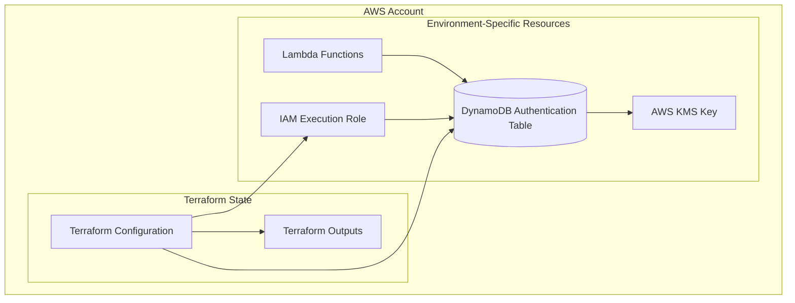

# Design Document

## Overview

The authentication infrastructure provides a secure, cost-effective foundation for user credential storage using AWS DynamoDB. This design implements a dedicated authentication data store that is isolated from other application data for enhanced security, optimized for pay-per-request billing, and designed for efficient Lambda function access patterns.

The system uses a simple but secure approach with hashed user identifiers and salted password hashes, following AWS security best practices for encryption at rest and access control.

## Architecture

### High-Level Architecture



### Data Flow

1. **User Registration**: Lambda function receives user credentials, hashes email to create user ID, salts and hashes password, stores in DynamoDB
2. **User Authentication**: Lambda function receives login request, hashes email to lookup user, compares salted password hash
3. **Environment Isolation**: Each environment (dev/prod) has separate DynamoDB tables with environment-specific naming

## Components and Interfaces

### DynamoDB Table Configuration

**Table Schema:**
- **Primary Key**: `user_id` (String) - SHA-256 hash of user email address
- **Attributes**:
  - `user_id` (S) - Hashed email address (primary key)
  - `password_hash` (S) - Salted and hashed password using bcrypt or similar
  - `created_at` (S) - ISO 8601 timestamp of account creation
  - `updated_at` (S) - ISO 8601 timestamp of last password update

**Table Configuration:**
- **Billing Mode**: `PAY_PER_REQUEST` for cost optimization
- **Encryption**: AWS managed KMS key (`alias/aws/dynamodb`)
- **Point-in-Time Recovery**: Enabled for data protection
- **Deletion Protection**: Enabled for production environment
- **Table Class**: `STANDARD` (default)

**Naming Convention:**
```
workout-tracker-auth-{environment}
```

### IAM Permissions

**Lambda Execution Role Permissions:**
```json
{
  "Version": "2012-10-17",
  "Statement": [
    {
      "Effect": "Allow",
      "Action": [
        "dynamodb:GetItem",
        "dynamodb:PutItem",
        "dynamodb:UpdateItem"
      ],
      "Resource": "arn:aws:dynamodb:*:*:table/workout-tracker-auth-*"
    }
  ]
}
```

**Security Principles:**
- Least privilege access - only necessary DynamoDB operations
- Resource-specific permissions scoped to authentication tables
- No administrative permissions (DeleteTable, etc.)

### Environment Configuration

**Environment Detection:**
- Uses `terraform.workspace` to determine environment
- Supports `development` and `production` workspaces
- Default workspace maps to development environment

**Environment-Specific Resources:**
```hcl
locals {
  environment = terraform.workspace == "production" ? "production" : "development"
  
  table_config = {
    development = {
      deletion_protection = false
      point_in_time_recovery = false
    }
    production = {
      deletion_protection = true
      point_in_time_recovery = true
    }
  }
}
```

## Data Models

### User Authentication Record

```json
{
  "user_id": "a665a45920422f9d417e4867efdc4fb8a04a1f3fff1fa07e998e86f7f7a27ae3",
  "password_hash": "$2b$12$LQv3c1yqBWVHxkd0LHAkCOYz6TtxMQJqhN8/LewdBPj/RK.PqHd.2",
  "created_at": "2024-01-15T10:30:00Z",
  "updated_at": "2024-01-15T10:30:00Z"
}
```

**Field Specifications:**
- `user_id`: SHA-256 hash of lowercase email address (64 character hex string)
- `password_hash`: bcrypt hash with cost factor 12 (60 character string)
- `created_at`: ISO 8601 UTC timestamp
- `updated_at`: ISO 8601 UTC timestamp

### Hash Generation Strategy

**User ID Generation:**
```
user_id = SHA256(lowercase(email_address))
```

**Password Hashing:**
```
password_hash = bcrypt(password + salt, cost=12)
```

**Benefits:**
- Consistent user ID generation from email
- No email storage in authentication table
- Strong password protection with bcrypt
- Configurable cost factor for future security adjustments

## Error Handling

### DynamoDB Error Scenarios

**Common Error Conditions:**
1. **ConditionalCheckFailedException**: User already exists during registration
2. **ResourceNotFoundException**: Table not found or misconfigured
3. **ProvisionedThroughputExceededException**: Unlikely with pay-per-request
4. **ValidationException**: Invalid attribute values or types
5. **AccessDeniedException**: IAM permission issues

**Error Handling Strategy:**
```go
// Example error handling pattern
switch err := err.(type) {
case *dynamodb.ConditionalCheckFailedException:
    return ErrUserAlreadyExists
case *dynamodb.ResourceNotFoundException:
    return ErrTableNotFound
case *dynamodb.ValidationException:
    return ErrInvalidInput
default:
    return ErrInternalServer
}
```

### Lambda Function Error Responses

**Standardized Error Format:**
```json
{
  "error": {
    "code": "USER_NOT_FOUND",
    "message": "User authentication failed",
    "timestamp": "2024-01-15T10:30:00Z"
  }
}
```

**Error Categories:**
- `USER_NOT_FOUND`: Authentication lookup failed
- `USER_ALREADY_EXISTS`: Registration conflict
- `INVALID_CREDENTIALS`: Password verification failed
- `INTERNAL_ERROR`: System or database errors

## Testing Strategy

### Unit Testing

**DynamoDB Mock Testing:**
- Use AWS SDK mocks for unit tests
- Test table operations without actual AWS resources
- Validate error handling for all DynamoDB exceptions
- Test hash generation and password verification logic

**Test Coverage Areas:**
1. User ID hash generation consistency
2. Password hashing and verification
3. DynamoDB put/get operations
4. Error handling for all failure scenarios
5. Environment-specific configuration

### Integration Testing

**Development Environment Testing:**
- Test against actual AWS DynamoDB in development environment
- Validate table creation and operations
- Test IAM permission configurations
- Verify environment-specific table naming

**Test Scenarios:**
1. User registration with duplicate email
2. Successful user authentication
3. Failed authentication with wrong password
4. Table access with correct/incorrect IAM permissions

### Infrastructure Testing

**Terraform Validation:**
- Validate Terraform configuration syntax
- Test plan generation for both environments
- Verify output values are correctly generated
- Test workspace switching functionality

**Security Testing:**
- Validate encryption at rest configuration
- Test IAM permission boundaries
- Verify no sensitive data in Terraform state
- Test deletion protection in production

## Security Considerations

### Data Protection

**Encryption Strategy:**
- **At Rest**: AWS managed KMS encryption for DynamoDB
- **In Transit**: HTTPS/TLS for all API communications
- **Application Level**: bcrypt for password hashing

**Key Management:**
- Use AWS managed keys for simplicity and cost
- No custom KMS keys required for initial implementation
- Future enhancement: customer-managed keys for compliance

### Access Control

**Principle of Least Privilege:**
- Lambda functions have minimal DynamoDB permissions
- No administrative access to table structure
- Environment-specific resource scoping

**Audit and Monitoring:**
- CloudWatch log groups managed by Terraform for Lambda functions
- DynamoDB access logging via CloudTrail
- Failed authentication attempt monitoring
- Structured JSON logging for authentication events

### Data Minimization

**Stored Data:**
- No email addresses stored in authentication table
- No plaintext passwords stored
- Minimal metadata (timestamps only)

**Data Retention:**
- No automatic data expiration (TTL) for user accounts
- Manual account deletion process
- Point-in-time recovery for accidental deletions

## Deployment Configuration

### Terraform Module Structure

```
infrastructure/
├── main.tf                 # Main configuration
├── variables.tf           # Input variables
├── outputs.tf            # Output values
├── dynamodb.tf           # DynamoDB table configuration
├── iam.tf               # IAM roles and policies
├── cloudwatch.tf         # CloudWatch log groups
└── locals.tf            # Local values and environment mapping
```

### CloudWatch Log Groups

**Managed Log Groups:**
- Authentication Lambda function log groups created by Terraform
- Environment-specific naming: `/aws/lambda/workout-tracker-auth-{environment}`
- Configurable retention periods (14 days development, 30 days production)
- Proper IAM permissions for Lambda to write logs

**Log Group Configuration:**
```hcl
resource "aws_cloudwatch_log_group" "auth_lambda" {
  name              = "/aws/lambda/workout-tracker-auth-${local.environment}"
  retention_in_days = 30
  
  tags = {
    Environment = local.environment
    Project     = "workout-tracker"
    Component   = "authentication"
  }
}
```

### Environment Management

**Environment-Specific Configuration:**
- Development: No deletion protection, basic monitoring
- Production: Deletion protection enabled, enhanced monitoring
- Consistent naming across environments with workspace suffix